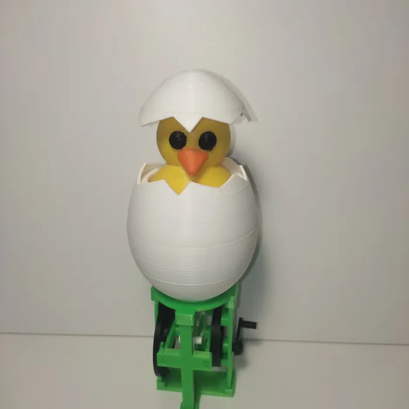

# 🐣 Cute Hatching Chick Automaton

> O jucarie care simulează ecloziunea unui pui din ou, acționat printr-un mecanism mecanic manual cu manetă rotativă.

---



##  Ideea


Scopul este de a crea o **jucărie mecanică fără electronice**, unde mișcarea este produsă exclusiv prin rotirea unei manete și transmisă printr-un lanț cinematic.

Răsucind maneta continuu, puiul "iese" și "intră" ritmic în ou — creând o animație mecanică infinită.

---

## Funcționare

Mecanismul convertește **rotația continuă** a manetei în **mișcare verticală** (sus-jos) a oului:

```
Utilizatorul rotește maneta albastră care descrie un cerc
        ↓
Rotația devine translație
        ↓
Platforma superioară urcă și coboară ritmic
        ↓
Jumătatea inferioară a oului urcă cu platforma
        ↓
Coaja spartă  rămâne fixă
        ↓
Puiul "iese" și "intră" în ou în mod repetat
```


## Componente

### Platformă superioară

### Oul

### Puiul


---

## Inspirație

https://www.printables.com/model/1253400-cute-hatching-chick-automaton-crank-operated-mecha


