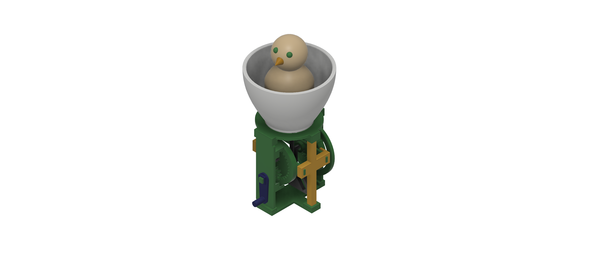

# 🐣 Hatching Chick Automaton — Jucărie mecanică imprimată 3D

## Descriere generală

**Hatching Chick Automaton** este o jucărie mecanică realizată în **Autodesk Fusion 360**, gândită pentru imprimare 3D. Proiectul reprezintă un pui așezat într-o coajă de ou, montat deasupra unui mecanism mecanic vizibil, acționat manual printr-o manivelă.

Modelul nu folosește motoare, senzori sau componente electronice. Mișcarea este gândită să fie produsă mecanic, prin rotirea manivelei și transmiterea rotației către roți dințate, camă și follower.

În versiunea actuală, partea decorativă este finalizată: puiul este poziționat în ou, iar mecanismul de jos este asamblat ca prototip mecanic. Transmiterea completă a mișcării este încă în proces de ajustare.



---

## Scopul proiectului

Scopul proiectului este realizarea unui obiect mecanic decorativ și printabil 3D, care combină modelarea 3D cu principii simple de mecanică.

Obiectivele principale au fost:

* modelarea pieselor în Fusion 360;
* organizarea pieselor în componente separate;
* realizarea unui ansamblu 3D coerent;
* integrarea unui mecanism cu manivelă, roți dințate, camă și follower;

---

## Principiul de funcționare

Ideea mecanismului este transformarea mișcării de rotație într-o mișcare alternativă.

Fluxul mișcării propuse este:

```text
Utilizatorul rotește manivela
        ↓
Manivela rotește roata mică
        ↓
Mișcarea este transmisă către roțile mai mari
        ↓
Cama ar trebui să acționeze follower-ul
        ↓
Follower-ul se deplasează vertical
        ↓
Puiul poate fi ridicat/coborât în ou
```

În stadiul actual, mecanismul este modelat și asamblat, dar încă necesită ajustări la poziționarea roților și la joint-uri pentru ca mișcarea să fie transmisă complet.


## Componente principale

| Componentă                        | Rol                                                        |
| --------------------------------- | ---------------------------------------------------------- |
| `box_bottom`                      | baza mecanismului                                          |
| `box_top`                         | suportul superior pentru ou                                |
| `box_left`, `box_right`           | pereții laterali ai cadrului                               |
| `box_rail_front`, `box_rail_back` | șine/supporturi pentru cadru                               |
| `bar_left`, `bar_right`           | suporturi verticale                                        |
| `manivela` / `crank`              | piesa rotită manual                                        |
| `Spur Gear 10 teeth`              | roata mică de antrenare                                    |
| `Spur Gear 20 teeth`              | roată intermediară                                         |
| `Spur Gear 30 teeth`              | roată mare                                                 |
| `cam`                             | piesă pentru transformarea rotației în mișcare alternativă |
| `follower`                        | piesă care urmărește cama                                  |
| `yoke_internal`, `yoke_involute`  | piese interne ale mecanismului                             |
| `yoke_body`, `yoke_support`       | suporturi pentru mecanismul de tip yoke                    |
| `link_arm`                        | braț de legătură                                           |
| `egg_bottom_shell`                | coaja inferioară a oului                                   |
| `chick_body`                      | corpul puiului                                             |
| `chick_head`                      | capul puiului                                              |
| `chick_beak`                      | ciocul puiului                                             |
| `chick_eyes`                      | ochii puiului                                              |


## Elemente mecanice folosite

Proiectul folosește următoarele concepte mecanice:

| Element mecanic | Rol în proiect                              |
| --------------- | ------------------------------------------- |
| Manivelă        | permite acționarea manuală                  |
| Roți dințate    | transmit mișcarea de rotație                |
| Camă            | transformă rotația în mișcare alternativă   |
| Follower        | urmărește profilul camei                    |
| Ghidaj          | menține mișcarea follower-ului pe verticală |
| Cadru fix       | susține toate componentele                  |

---

## Roți dințate

Roțile au fost generate cu scriptul de **Spur Gear** din Fusion 360.

Pentru ca roțile să fie compatibile, acestea trebuie să aibă aceleași valori pentru:

| Parametru      |   Valoare |
| -------------- | --------: |
| Module         |     `1.0` |
| Pressure Angle |     `20°` |
| Backlash       | `0.10 mm` |

Numărul de dinți este diferit:

| Roată       | Număr de dinți |
| ----------- | -------------: |
| Roată mică  |             10 |
| Roată medie |             20 |
| Roată mare  |             30 |

Poziționarea roților este importantă, deoarece acestea trebuie să fie aliniate în același plan și să aibă distanța corectă între centre.

---

## Joint-uri și mișcare

În Fusion 360 au fost folosite joint-uri pentru asamblarea și testarea mecanismului:

| Componente            | Tip joint                | Rol                                    |
| --------------------- | ------------------------ | -------------------------------------- |
| Cadru                 | `Ground` / `Rigid Joint` | fixează structura                      |
| Manivelă + roată mică | `Rigid Joint`            | se rotesc împreună                     |
| Roți + cadru          | `Revolute Joint`         | permit rotația roților                 |
| Roți între ele        | `Motion Link`            | sincronizează rotația                  |
| Follower + ghidaj     | `Slider Joint`           | permite mișcarea verticală             |
| Ou + cadru            | `Rigid Joint`            | fixează oul pe suport                  |
| Pui + suport mobil    | `Rigid Joint`            | permite conectarea puiului la mecanism |

Motion study-ul este folosit pentru testarea mișcării în Fusion 360.


## Printabilitate

* cadrul este împărțit în componente separate;
* piesele mobile sunt separate de piesele fixe;
* oul este simplificat pentru a reduce suporturile;
* puiul este realizat din forme simple și rotunjite;
* roțile, axele și follower-ul necesită toleranțe;


## Fișiere incluse

Repository-ul conține:

* fișierul Fusion 360 `.f3d`;
* fișiere STL pentru componentele printabile;
* fișiere G-code pentru piesele pregătite în slicer;
* imagini cu modelul;
* link către video-ul demonstrativ.

---

## Resurse folosite

* Autodesk Fusion 360;
* PrusaSlicer;
* GitHub;

Model de inspirație:

**Cute Hatching Chick Automaton — Crank Operated Mechanical Toy Model**
https://www.printables.com/model/1253400-cute-hatching-chick-automaton-crank-operated-mecha


